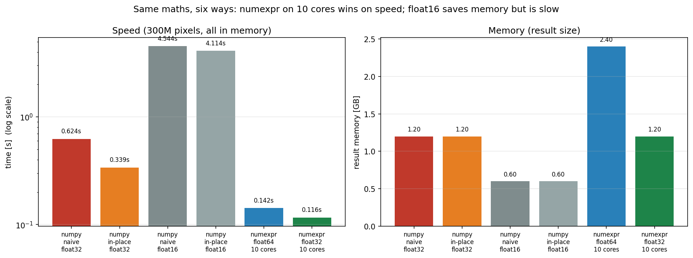
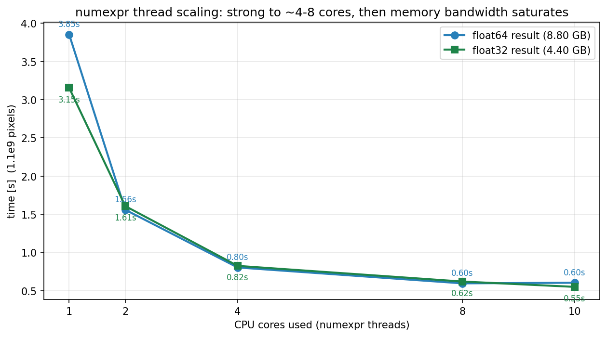

# Optimising a large image operation

**Operation:** `|I1 - I2| / (I1 + I2 + eps)` on two **1.1-billion-pixel** `uint8` images.
**Goal:** fastest runtime, least RAM.
**Deliverables:** this summary, `optimisation_slides.pptx`, and the scripts
`normdiff_benchmark.py` / `normdiff_numexpr.py`.

---

## TL;DR

> **Use `uint8` inputs + `numexpr` on all cores + force a `float32` result.**
> That gives **~0.49 s and 4.40 GB** for 1.1 billion pixels, versus **10.74 s and
> heavy disk-swapping** for the naive numpy one-liner.

Forcing numexpr's result to 32-bit is a **free win**: same speed as 64-bit,
**half the RAM**, identical answer.

---

## The problem

- Two images, 1.1e9 pixels each (`32,000 x 34,375`), stored as `uint8` (0..255).
- The maths must run in a wider type: on `uint8`, `I1 - I2` wraps and
  `I1 + I2` overflows.
- It is **memory-bound** — the arithmetic is trivial; runtime is dominated by how
  many bytes move (and whether they fit in RAM).

---

## What we varied

1. **Input storage** — `uint8` vs `float32`.
2. **Compute/result type** — `float16` / `float32` / `float64`.
3. **Code style** — naive literal one-liner vs in-place (`out=` reuse).
4. **Library** — numpy vs **numexpr** (JIT-compiled, multithreaded).
5. **CPU cores** — 1, 2, 4, 8, 10.
6. **Forced result type** — numexpr `float64` vs forced `float32`.

Measured with `time.perf_counter`; arrays allocated before timing; a checksum
afterwards proves the result is real and correct.

---

## Results — all methods (1.1e9 pixels, `uint8` inputs)

| Method | Type | Cores | Time | Gpixel/s | Result RAM | Note |
|---|---|--:|--:|--:|--:|---|
| numpy naive (literal) | float32 | 1 | 10.74 s | 0.10 | 4.40 GB | spilled to disk |
| numpy in-place (`out=`) | float32 | 1 | ~1.8 s | ~0.62 | 4.40 GB | 1.8–4.0 s with load |
| numpy naive | float16 | 1 | 16.93 s | 0.06 | 2.20 GB | float16 slow on CPU |
| numpy in-place | float16 | 1 | 15.27 s | 0.07 | 2.20 GB | float16 slow on CPU |
| numexpr (`casting='safe'`) | float64 | 10 | 0.514 s | 2.14 | 8.80 GB | fastest; 2x memory |
| **numexpr forced `out=float32`** | **float32** | **10** | **0.486 s** | **2.26** | **4.40 GB** | **best overall** |

All float32/float64 methods give the same checksum (`4.275743e+08`).



---

## Results — stable in-RAM comparison (300M pixels)

| Method | Type | Cores | Time | Gpixel/s | Result RAM |
|---|---|--:|--:|--:|--:|
| numpy naive | float32 | 1 | 0.624 s | 0.48 | 1.20 GB |
| numpy in-place | float32 | 1 | 0.339 s | 0.89 | 1.20 GB |
| numpy naive | float16 | 1 | 4.544 s | 0.07 | 0.60 GB |
| numpy in-place | float16 | 1 | 4.114 s | 0.07 | 0.60 GB |
| numexpr | float64 | 10 | 0.142 s | 2.11 | 2.40 GB |
| numexpr forced | float32 | 10 | 0.116 s | 2.60 | 1.20 GB |

---

## Results — numexpr thread scaling (1.1e9 pixels)

| Cores | float64 time | float64 Gpixel/s | float32 time | float32 Gpixel/s |
|--:|--:|--:|--:|--:|
| 1 | 3.853 s | 0.29 | 3.155 s | 0.35 |
| 2 | 1.559 s | 0.71 | 1.607 s | 0.68 |
| 4 | 0.804 s | 1.37 | 0.825 s | 1.33 |
| 8 | 0.596 s | 1.85 | 0.620 s | 1.77 |
| 10 | 0.604 s | 1.82 | **0.550 s** | **2.00** |



- Big gains to ~4–8 cores; then the **memory bus saturates**.
- **1 thread = numpy speed** → the ~8x win comes from using all cores.
- `float32` is as fast or faster everywhere, at half the RAM.

---

## The winning configuration

```
uint8 inputs  +  numexpr  +  all cores  +  forced float32 result
=> ~0.49 s and 4.40 GB for 1.1 billion pixels
```

```bash
.venv/bin/python normdiff_numexpr.py --pixels 1.1e9 --mode numpy numexpr \
    --out-dtype float32
```

---

## Lessons for code optimisation

1. **Keep inputs small** — `uint8`, not `float32` (4x less data; removes swap).
2. **Compute in `float32`** — never in `uint8` (wraps/overflows).
3. **Reuse memory** — in-place / `out=` avoids full-size temporaries (~2x).
4. **Parallelise** — numexpr across all cores (the single biggest speed win).
5. **Force the 32-bit result** — same speed, half the memory.
6. **Keep data in RAM** — swapping to disk cost ~10x.
7. **If it cannot fit, chunk it** — process row-blocks to avoid swap.
8. **Report timings with context** — input dtype, compute dtype, cores, and
   in-RAM vs swap; each changes the result by large factors.

### Chooser

| Situation | Best choice |
|---|---|
| Small/medium array, simple code | numpy naive |
| Large array, no extra packages | numpy in-place (`out=`) |
| Array barely fits in RAM | `float16` or chunk the work |
| Many cores, max speed | numexpr |
| Max speed **and** min memory | **numexpr forced `float32`** |
